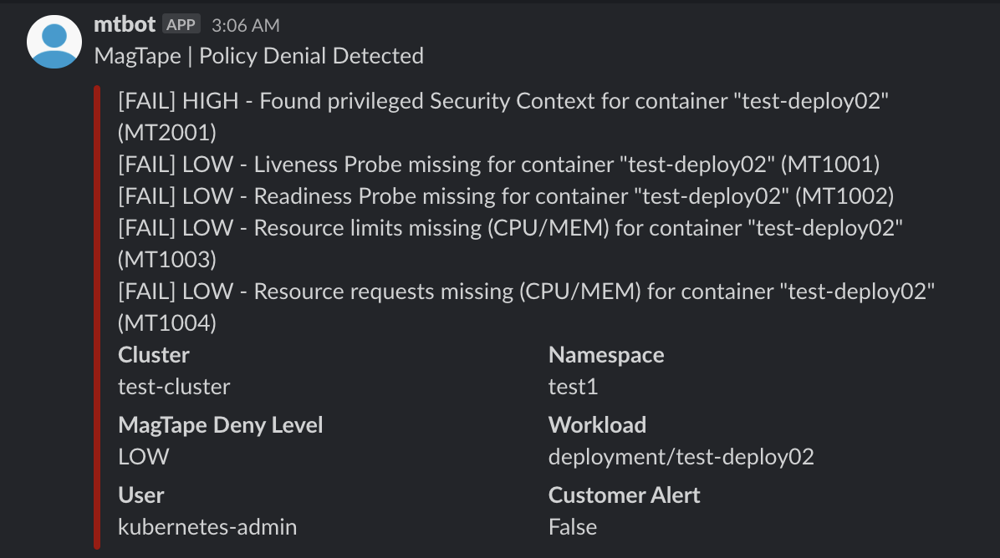
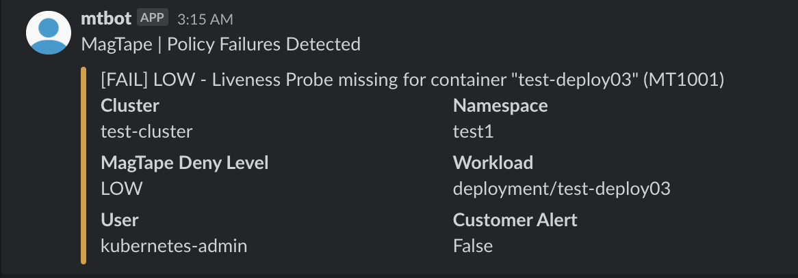

[](https://github.com/tmobile/magtape/releases/latest)
[](https://github.com/tmobile/magtape/blob/master/LICENSE)

# MagTape

MagTape is a Policy-as-Code tool for Kubernetes utilizing the Validating [Admission Webhook](https://kubernetes.io/docs/reference/access-authn-authz/extensible-admission-controllers/#admission-webhooks) model. MagTape leverages [OPA](https://www.openpolicyagent.org) under the covers for it's generic policy engine and language, but also adds some additional features and flexibility on top of what OPA offers out of the box.

MagTape is NOT meant to be a replacement or competitor to OPA, but rather an example of wrapping additional business logic and features around OPA's core. MagTape is also not primarily meant to be a security tool, even though it can easily enforce security policy.

## Overview

MagTape examines kubernetes objects against a set of defined policies (best practice configurations/security concepts) and can deny/alert on objects that fail policy checks. The webhook is written in `Python` using the `Flask` framework.

- [Prereqs](#prereqs)
- [Quickstart](#quickstart)
- [Policies](#policies)
- [Deny Level](#deny-level)
- [Health Check](#health-check)
- [Image](#image)
- [K8s Events](#k8s-events)
- [Slack Alerts](#slack-alerts)
- [Metrics](#metrics)
- [Advances Install](docs/install.md)
- [Testing](#testing)
- [Troubleshooting](#troubleshooting)

### Prereqs

Kubernetes 1.9.0 or above with the `admissionregistration.k8s.io/v1beta1` API enabled. Verify that by the following command:

```shell
$ kubectl api-versions | grep admissionregistration.k8s.io/v1beta1
```

The result should be:

```shell
admissionregistration.k8s.io/v1beta1
```

In addition, the `MutatingAdmissionWebhook` and `ValidatingAdmissionWebhook` admission controllers should be added and listed in the correct order in the admission-control flag of kube-apiserver.

#### Permissions

MagTape requires cluster-admin permissions to deploy to Kubernetes since it requires access to create/read/update/delete cluster scoped resources (ValidatingWebhookConfigurations, Events, etc.)

### Quickstart

You can use the following command to install MagTape and the example policies from this repo with sane defaults. This won't have all features turned on as they require more configuration up front. Please see the [Advanced Install](#advanced-install) section for more details.

```
$ kubectl apply -f https://github.com/tmobile/magtape/blob/master/deploy/install.yaml
```

#### This will do the following

- Create the `magtape-system` namespace
- Create cluster and namespace scoped roles/rolebindings
- Deploy the MagTape workload and related configs
- Deploy the example policies from this repo

#### Once this is complete you can do the following to test

Create and label a test namespace

```shell
$ kubectl create ns test1
$ kubectl label ns test1 k8s.t-mobile.com/magtape=enabled
```

Deploy some test workloads

```shell
# These examples assume you're in the root directory of this repo
# Example with no failures

$ kubectl apply -f ./testing/deployments/test-deploy01.yaml

# Example with deny

$ kubectl apply -f ./testing/deployments/test-deploy02.yaml

# Example with failures, but no deny

$ kubectl apply -f ./testing/deployments/test-deploy03.yaml
```

### Cleanup

Remove all MagTape deployed resources

```shell
# Assumes you're in the root directory of this repo
make clean
```

### Policies

The below policies are included by default. The default policies can be removed or custom policies can be added. Policies use OPA's Rego language with a specific format to define policy metadata and the output message. This special formatting enables the additional functionality of MagTape.

- Liveness Probe (Check ID: MT1001)
- Readiness Probe (Check ID: MT1002)
- Resource Limits (Check ID: MT1003)
- Resource Requests (Check ID: MT1004)
- Pod Disruption Budget (Check ID: MT1005)
- Privileged Pod Security Context (Check ID: MT2001)

The policy metadata is defined within each policy similar to this:

```
policy_metadata = {

    # Set MagTape Policy Info
    "name": "policy-resource-requests",
    "severity": "LOW",
    "errcode": "MT1004",
    "targets": {"Deployment", "StatefulSet", "DaemonSet", "Pod"},

}
```

- `name` - Defines the name of the specific policy. This should be unique per policy.
- `severity` - Defines the severity level of a specific policy. This correlates with the [DENY_LEVEL](#deny-level) to determine if a policy should result in a deny or not.
- `errcode` - A unique code that can be used, typically in reference to an FAQ, to look up additional information about the policy, what produces a failure, and how to resolve failures.
- `targets` - This controls which Kubernetes resources the policy targets. Each target should be the singular of the Kubernetes resource as found in the `Kind` field. Special care should be taken to make sure all target resources maintain similar JSON data paths within the policy logic, or that differences are handled appropriately.

### Deny Level

Each policy is assigned a Severity level "LOW", "MED", or "HIGH". This is used to influence what policy checks result in an actual deny, or just become passive (alerting only)

The Deny Level is set within the deployment via an environment variable (`MAGTAPE_DENY_VOLUME`) and can be set to "OFF", "LOW", "MED", or "HIGH". The Deny Level has an inverse relationship to the Severity of the defined checks, which works as follows:

| Deny Level    | Severities Blocked |
|---            |---                 |
| OFF           | None               |
| LOW           | HIGH               |
| MED           | HIGH, MED          |
| HIGH          | HIGH, MED, LOW     |

This configuration provides flexibility around controlling which checks should result in a "deny" and allows for a progressive approach as the platform and its users mature

### Health Check

MagTape has a rudimentary healthcheck endpoint configured at `/healthz`. The endpoint displays a json output including the name of the pod running the webhook, the datetime of the request, and the overall health. This is nothing fancy. If the Flask app is running at all the health will report ok.

## Image

MagTape uses a few images for operation. Please reference the image repos for more information on the image structure and contents

- [magtape and magtape-init](https://github.com/tmobile/magtape-image)
- [opa](https://github.com/open-policy-agent/opa)
- [kube-mgmt](https://github.com/open-policy-agent/kube-mgmt)

## K8s Events

K8s Events can be generated for policy failures via the `MAGTAPE_K8S_EVENTS_ENABLED` environment variable.

Setting this variable to `TRUE` will cause a Kubernetes event to be created in the target namespace of the request object when a policy failure occurs. This will provide a more native method to passively inform users on policy failures (regardless of whether or not the request is denied).

## Slack Alerts

Slack alerts can be enabled and controlled via environment variables (noted above):

- MAGTAPE_SLACK_ENABLED
- MAGTAPE_SLACK_PASSIVE
- MAGTAPE_SLACK_WEBHOOK_URL_BASE
- MAGTAPE_SLACK_WEBHOOK_URL_DEFAULT
- MAGTAPE_SLACK_ANNOTATION
- MAGTAPE_SLACK_USER
- MAGTAPE_SLACK_ICON

### Override base domain for Slack Incoming Webhook URL

Some airgapped environments may need to use a forwarder/proxy service to assist in sending alerts to the Slack API. the `MAGTAPE_SLACK_WEBHOOK_URL_BASE` environment variable allows you to override the base domain for the Slack Incoming Webhook URL to target the forwarding/proxy service. This is very assumptive that the forwarding/proxy service will accept a Slack compliant payload and that the endpoint differs from the default Slack Incoming Webhook URL in domain only (ie. the protocol and trailing paths remain the same).

EXAMPLE:

```shell
MAGTAPE_SLACK_WEBHOOK_URL_DEFAULT="https://hooks.slack.com/services/XXXXXXXX/XXXXXXXXXXXX"
MAGTAPE_SLACK_WEBHOOK_URL_BASE="slack-proxy.example.com"
```

This configuration will override `hooks.slack.com` to be `slack-proxy.example.com` and the outcome will be:

```shell
https://slack-proxy.example.com/services/XXXXXXXX/XXXXXXXXXXXX
```

**NOTE:** The `MAGTAPE_SLACK_WEBHOOK_URL_BASE` environment variable is optional and if not specified the URL will remain unchanged from what is set in `MAGTAPE_SLACK_WEBHOOK_URL_DEFAULT`

### Default Alert Target

When alerts are enabled they will be sent to the Slack Incoming Webhook URL defined in the `MAGTAPE_SLACK_WEBHOOK_URL_DEFAULT` environment variable. This is meant to be a channel controlled by the MagTape Webhook administrators.

### Custom Alert Target

When alerts are enabled they can be sent to a custom Slack Incoming Webhook URL in addition to the default mentioned above. This can be configured via an annotation on the Kubernetes namespace. The annotation key is defined by the `MAGTAPE_SLACK_ANNOTATION` environment variable. This will allow customers to configure the expected annotation along with their own Slack Incoming Webhook URL as the value to target alerts at their own Slack Channel. Customers will only receive alerts for request objects targeted for their own namespace.

### Alert Format

Slack alert examples:





NOTE: For Slack Alerts to work, you will need to configure a Slack Incoming Webhook and set the environment variable for the webhook deployment as noted above.

## Metrics

Prometheus formatted metrics are exposed on the `/metrics` endpoint. Metrics track counters for requests by:

- CPU, Memory, and HTTP error rate
- Number of requests passed, failed, and total
- Breakdown by namespace
- Breakdown by policy

 Grafana dashboards showing CLuster, Namespace, and Policy scoped metrics are available in the [metrics](./metrics/grafana) directory. An example Prometheus ServiceMonitor resource is located [here](./metrics/prometheus).

## Testing

- Create namespace for testing and label it appropriately

  ```shell
  $ kubectl create ns test1
  $ kubectl label ns test1 k8s.t-mobile.com/magtape=enabled
  ```

- Deploy test deployment to Kubernetes cluster

  ```shell
  $ kubectl apply -f test-deploy02.yaml -n test1
  ```

  NOTE: MagTape should deny this workload and should provide feedback similar to this:

    ```shell
    $ kubectl apply -f test-deploy02.yaml -n test1

    Error from server: error when creating "test-deploy02.yaml": admission webhook "magtape.webhook.k8s.t-mobile.com" denied the request: [FAIL] HIGH - Found privileged Security Context for container "test-deploy02" (MT2001), [FAIL] LOW - Liveness Probe missing for container "test-deploy02" (MT1001), [FAIL] LOW - Readiness Probe missing for container "test-deploy02" (MT1002), [FAIL] LOW - Resource limits missing (CPU/MEM) for container "test-deploy02" (MT1003), [FAIL] LOW - Resource requests missing (CPU/MEM) for container "test-deploy02" (MT1004)
    ```

### Test Samples Available

Info on testing resources can be found in the [testing](./testing) directory

## Troubleshooting

### Certificate Trust

Make sure you've patched the ValidatingWebhookConfiguration with the Kubernetes CA bundle. If this is not done the required trust between the K8s API and Webhook will not exist and the Webhook won't work correctly. More info is [here](#installation)

### Access MagTape API from local machine

```shell
$ kubectl get pods # to get the name of the running pod
$ kubectl port-forward <pod_name> -n <namespace> 5000:5000
```

### Use Curl to perform HTTP POST to MagTape

```shell
$ curl -vX POST https://localhost:5000/ -d @test.json -H "Content-Type: application/json"
```

NOTE: Since the python client library for Kubernetes was added to facilitate making calls to the Kubernetes API Server, testing the script locally (not on a K8s Cluster) will fail if the `MAGTAPE_K8S_EVENTS_ENABLED` ENV variable is set to `TRUE`

### Follow logs of the webhook pod

```shell
$ kubectl get pods # to get the name of the running pod
$ kubectl logs <pod_name> -n <namespace> -f
```
